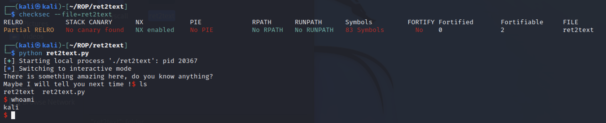

# PWN入门小练习

## 常用工具

在CTF的pwn题目中，我们会拿到一个二进制文件，即源代码编译时生成的.o文件，这个文件是我们入侵的目标系统上正在执行的程序。进行攻击时，需要通过分析找到这个二进制文件中的漏洞，最终目标是利用漏洞获取目标系统的最高权限。

在分析和编程时，常用工具如下：

### IDA pro

IDA全称是交互式反汇编器专业版（Interactive Disassembler Professional），是一个静态反编译软件。在IDA中，可以查看二进制文件内容，还可以查看反编译产生的C语句。

使用方法非常简单，直接将二进制文件添加到IDA中打开即可。注意IDA分为32位和64位两个版本（据说32位版本允许将汇编语言反编译为C语言，而64位版本没有该功能）。

如果想查看反编译出的C代码，可以按tab键。

P.S点开IDA的时候需要调整为英文输入法，不然会报错。

### VMWare + kali linux

kali linux是基于Debian的Linux发行版，是参加CTF时最常用的操作系统。其中预装了超过300个渗透测试工具，方便使用。

kali是开源镜像，可以在其官网上下载其虚拟机镜像，使用VMWare打开虚拟机。

### pwntools

pwntools是python第三方工具，是一个CTF框架和漏洞利用开发工具。其基本模块包括asm（汇编与反汇编）、dynelf（远程符号泄漏）、elf（读取elf文件）、gdb（配合gdb调试）、memleak（内存泄漏）、shellcraft（shellcode生成器）。

常用的pwn函数有：

```python
remote(address, port)
```

产生一个远程socket，这样就可以与目标服务器或程序进行交互（读写）了。

```python
sh = process("./ret2text")
```

也可以使用process打开一个本地程序并与之交互。

```python
sh.send(data)
sh.shendline(data)
```

两种发送数据的方式。两者之间的区别是：后者是发送一行数据，相当于在数据末尾加\n。

```python
sh.recv(numb=4096, timeout=default)
sh.recvall()
sh.recvline(keepends=True)
sh.recvuntil(delims, drop=False)
sh.recvrepeat(timeout=default) 
```

五种接受数据的方式。第一种接受指定长度的数据；第二种一直接收，直到收到EOF；第三种接收一行，keepends表示结尾是否保留\n；第四种一直接收，直到收到delims对应的pattern；第五种一直接收，直到收到EOF或超时。

```python
sh.interactive()
```

直接进行交互，相当于回到shell的模式，在取得shell之后使用

```python
asm(str)
```

接收一个字符串，得到该字符串座位汇编码时对应的机器码。

```python
p32(0xdeadbeef)
```

数据打包，用来将整数值转化为32位/64位地址的方法，使得构造payload更加方便。

函数p32/p64用来打包一个整数，函数u32/u64用来解码字符串，得到整数。

### checksec

为了保护程序不被入侵，程序编译时会使用一些安全保护手段。在攻击之前，我们需要知道目标系统运行的程序上打开了哪些安全属性，并制定相应的入侵策略。在编译时，用户可以向gcc提供标志位，以启用或禁用二进制文件的某些属性，这些属性与安全性相关。

checksec是分析二进制文件时常用的工具之一。它可以识别编译时构建到二进制文件中的安全属性。识别的安全属性包括RELRO、STACK CANARY、NX、PIE等。

checksec的安装：

```
sudo apt install checksec
```

checksec的使用：

```
checksec --file=ret2text
```

checksec识别的安全属性：

（1）RELRO：分为两种情况，Partial RELRO部分开启堆栈地址随机化，GOT表可写；Full RELRO完全开启堆栈地址随机化，GOT表不可写。GOT表是全局偏移表。此项的目的是减少对GOT表的攻击。

（2）CANARY：在函数开始时随机产生一个值canary，将其放在栈上紧挨着ebp的位置。如果攻击者想通过缓冲区溢出来覆盖ebp和ebp以下的地址时，一定会覆盖掉canary。当程序结束时，会检查canary，如果不一致则不会往下运行，从而避免缓冲区溢出攻击。

（3）NX：将数据所在的内存页标识为不可执行。当程序溢出成功转入shellcode时，程序会尝试在数据页上执行指令，此时CPU会抛出异常，而不是执行恶意指令。

（4）PIE：内存地址随机化。在PIE未开启时，每次加载程序的地址是固定的，但开启后每次程序启动的时候都会随机变换加载地址。


## 实例分析

本仓库中实现了五个入门级别的PWN小练习。

### ret2text



### ret2shellcode


### ret2syscall


### ret2libc1


### ret2libc2

